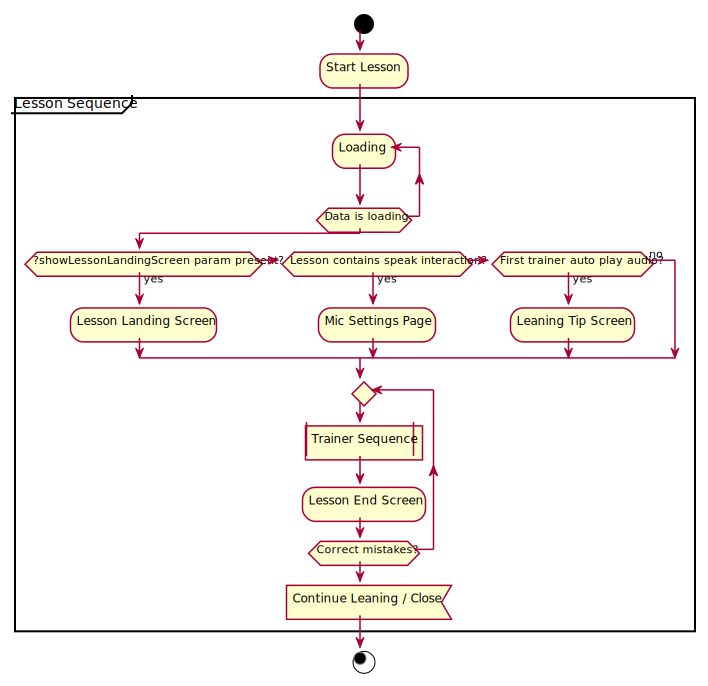
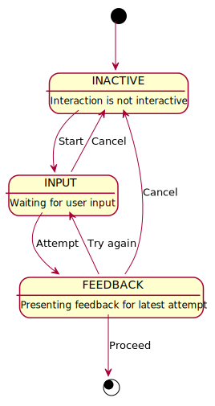

# Core Concepts

Describes important domain concepts and architecture.

> :bulb:	It's a good idea to get familiar with the [Content Model](./content-model.md) if you haven't already.

- [Trainers](#trainers)
  - [Naming](#naming)
  - [Combination Support Matrix](#combination-support-matrix)
  - [Anatomy](#anatomy)
    - [Lesson Sequence](#lesson-sequence)
    - [Trainer Sequence](#trainer-sequence)
    - [Trainer](#trainer)
    - [Interaction](#interaction)
- [High level implementation](#high-level-implementation)
  - [Trainer](#trainer-1)
    - [Interface](#interface)
  - [Interaction](#interaction-1)
    - [Interface](#interface-1)
  - [Trainer Features](#trainer-features)
    - [Translation Visibility](#translation-visibility)
    - [Info Text Popup](#info-text-popup)
    - [Item Sound Playback](#item-sound-playback)
    - [Dictate flag](#dictate-flag)
  - [Interaction Features](#interaction-features)

# Trainers

## Naming

The Babbel convention is to join `TrainerType` and `TrainerInteraction` to refer to a trainer. eg. "VocabularySpeak".
This is the name used in communication in the company, CAT tool and tracking events. The list of possible combinations are here [Trainer Types in Published](https://confluence.internal.babbel.com/display/DQA/Trainer+Types+in+Published)

> :bulb:	The application is currently using the v2 graph converter output [Trainer Space 2020](https://docs.google.com/spreadsheets/d/1AWnR3br9nQX0HvSCSLjIyaJc3VaAh3bo6mnA5qXmKvM/edit#gid=1328457760)

In the Model Today we have `Trainer.dictate` & `Trainer.puzzleHelper` which contribute to a more complex relationship between the "Babbel" name and the Model. See [R2-D2 - Trainer Type Map](https://confluence.internal.babbel.com/display/PM/R2-D2+-+Trainer+Type+Map)

However, `Trainer.puzzleHelper` will be removed (in the v3 graph converter) in favour of adding a "puzzlehelper" `TrainerInteraction`. In addition `TrainerType.Dictate` will be removed, those trainers will become `TrainerType.Vocabulary`. The `Trainer.dictate` flag will remain to indicate whether the `Item.sound` should play before or after a user completes an item. 

For the React codebase the mapping from the Model to the trainer implementation takes place in [getComponentFromTrainerType](https://github.com/lessonnine/lesson-player.spa/blob/db2f9a3e174102139212f8bd1059b6402382f1ca/src/lib/getComponentFromTrainerType.js#L14)

## Combination Support Matrix

| Trainer / Interaction | vocabulary | dialog | card | matching | comprehension | keyboard |
| --------------------- | ---------- | ------ | ---- | -------- | ------------- | -------- |
| choose                | ☑          | ☑      | ☑    | ☑        | ☑             |          |
| write                 | ☑          | ☑      | ☑    |          |               | ☑        |
| puzzlehelper          | ☑          | ☑      | ☑    |          |               |          |
| speak                 | ☑          | ☑      |      |          |               |          |
| show                  | ☑          |        |      |          |               |          |
| wordorder             | ☑          |        |      |          |               |          |
| click                 | ☑          |        |      |          |               |          |

## Anatomy

### Lesson Sequence

The lesson sequence is the top level structure for the lesson flow. It is responsible for the states that happen before and after the trainers. For example loading state, learning tip screen and lesson end screen.



### Trainer Sequence

The trainer sequence is responsible for keeping state of which trainer (`Lesson.trainers[]`) in the lesson should be displayed to the user.


### Trainer

The trainer is responsible for the layout and sequencing of `Item[]` presented to the user.
Items are structured in `Trainer.itemGroups` to separate logical sequences of items. The way those should be expanded may vary depending on the trainer type. In most cases it's safe to flatten those groups into a single list of items.
The trainer may position and render several items (via Interaction) on the same screen at a time, however there should only ever be one active.


A trainer has 3 main UI states:


### Interaction

The interaction is responsible for breaking an item down into its interactive elements and managing the sequencing over those elements. For each element, the user does some input, that input is validated and they are given some feedback. That process generates an attempt.


An interaction has 3 main UI states:



# High level implementation

As shown by the support matrix, trainers and interactions have a high level of interoperability with each other and with the application.
This section takes a closer look at the interfaces required for Trainers and Interactions in order for them to fit with each other and with the application.

## Trainer

A Trainer is a self contained unit of the lesson-player application. This means we aim to reduce dependence on the rest of the application and give trainers the ability to work autonomously.

### Interface

As defined here `CommonTrainerInterface` represents the basic interface a trainer needs to interact with the application.

```typescript
interface TrainerData {
  interactionMode: TrainerInteraction;
  itemPositionInTrainer: number;
  numberOfItemsInTrainer: number;
  translationMode: TrainerTranslationVisibility;
}

interface CommonTrainerInterface {
  learnLanguageAlpha3: LearnLanguageAlpha3;
  trainer: Trainer;

  /**
   * Called when the trainer is mounted.
   * The trainer reports the final number of scorable items back to the app.
   */
  onStart: (params: { scorableItemsCount: number }) => void;

  /**
   * The trainer should report every user attempt to the
   * application with context about the item and trainer state.
   */
  attemptItem: (item: Item, attempt: Attempt, trainerData: TrainerData) => void;

  /**
   * The trainer should report when an item has been completed
   * with context about the total number of mistakes (incorrect attempts) for that item.
   */
  completeItem: (item: Item, mistakes: number) => void;

  /**
   * The trainer should report when all items have been completed
   * and the user intends to go to the next trainer.
   */
  onFinish: () => void;
}
```

## Interaction

### Interface

As defined here `CommonInteractionInterface` represents the basic interface an interaction needs to interact with a trainer.

```typescript
interface Attempt {
  number: number;
  solved: boolean;
  text: string;
  targetText: string;
}

interface CommonInteractionInterface {
  learnLanguageAlpha3: LearnLanguageAlpha3;
  item: ContentModel.Item;
  active: boolean;

  /**
   * The interaction should report every user attempt to the
   * trainer with context about the text.
   */
  onAttempt: (attempt: Attempt) => void;

  /**
   * The interaction should report when a text has been completed.
   * with context about the total number of mistakes (incorrect attempts) for that text.
   */
  onFinish: (mistakes: number) => void;
}
```

This is how those interfaces interact over time.


## Trainer Features

These are features that are applied across trainer types, they should not depend on the interaction.

| Trainer / Feature      | vocabulary | dialog | card | matching | comprehension | keyboard |
| ---------------------- | ---------- | ------ | ---- | -------- | ------------- | -------- |
| translation visibility | ☑          | ☑      | ☑    | ☑        | ☑             | ☑        |
| info text popup        | ☑          | ☑      | ☑    | ☑        |               | ☑        |
| item sound playback    | ☑          | ☑      | ☑    | ☑        |               | ☑        |
| dictate flag           | ☑          | ☑      |      |          | ☑             |          |

### Translation Visibility

Support for translation visibility means a trainer should respect `Trainer.translationVisibility` set by editors. Translations (`Item.displayLanguageText`) are display accordingly:

- `TrainerTranslationVisibility.Full` - Translation is always displayed.
- `TrainerTranslationVisibility.None` - Translation is never displayed.
- `TrainerTranslationVisibility.Partial` - Translation is displayed on request of the user.

### Info Text Popup

When an interactive or non interactive item contains `Item.infoText`, this information should be displayed to the user.

### Item Sound Playback

After the successful completion of an interactive item the `Item.sound` should be played if it exists.
Sounds for non interactive should also be played when they are reached in the sequence of items.

### Dictate flag

`Trainer.dictate` flag is a modifier for "Item Sound Playback" which indicates the sound for interactive items should be played when the item is presented to the user, rather than after item completion.


## Interaction Features

These are features that are applied across interaction types, they should not depend on the trainer type.

| Interaction / Feature | choose | write | puzzlehelper | speak | show | wordorder | click |
| --------------------- | ------ | ----- | ------------ | ----- | ---- | --------- | ----- |
| transliteration       |        | ☑     | ☑            |       |      |           |       |
