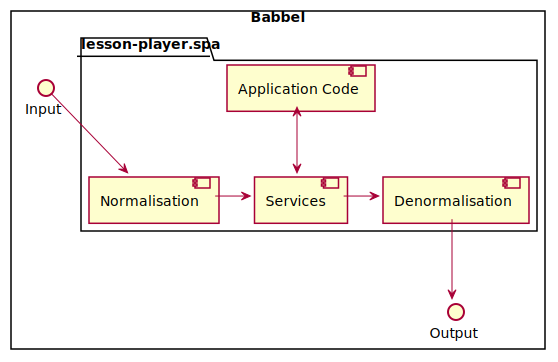

# AD-06: Data Normalisation
- *Creation*: 2020-11-22
- *Deciders*: @lessonnine/r2d2
- *Last Review*: 2020-12-07
- *Reviewers*: @beanqueen, @daviderama, @Marcel-G
- *Status*: ACCEPTED
- *Domain Group*: @lessonnine/r2d2

## Related

In Javascript, the convention is to use [camelCase](https://en.wikipedia.org/wiki/Camel_case) for variables and object keys [see MDN Guidelines](https://developer.mozilla.org/en-US/docs/MDN/Guidelines/Code_guidelines/JavaScript#Object_naming). In the lesson-player we predominantly use [camelCase](https://en.wikipedia.org/wiki/Camel_case) however, we sometimes have [snake_case](https://en.wikipedia.org/wiki/Snake_case).

The [internal content model](../content-model.md#lesson-data) of lesson-player is defined with camel case keys yet in practice there is a mix of styles for these entities depending on where in the codebase they are.

## Context

At Babbel, the backend services expect snake case keys. This is true for tracking events we send and data we consume from APIs. We sometimes normalise incoming data using `camelize` but it is not applied in all cases. We do not denormalise outgoing data, tracking event payloads for example.
This leads to a mixture of object key and variable name styles in the code that adds complexity to maintain.

**This ADR aims to make a decision on a single style so that we're aligned as a team on our basic code style.
It also aims to decide on a plan to implement a single style in small iterations over time.**

## Possible Solutions

Normalisation; recursively rename keys from snake case to camel case.

Denormalisation; recursively rename keys from camel case to snake case.

Use camel case keys for all application code*, including services. Any data that enters and exits the app goes through normalisation and denormalisation functions.

* This refers only to b4 code. b3 is legacy and we're actively replacing it.

## Potential risk

Left un-checked, this has a rather high contagion; therefore over time it only gets more difficult to solve without a decision.

While the solution is quite straight forward, the change has a rather high impact on the code because of the current mix of styles in the project.

## Decision

We have decided to use use only camel case keys within the project and normalise any data coming in and out of the application appropriately. We will do this over time with small iterations, starting with enabling linter warnings for such cases.
We will aim to not introduce any new camel case keys, for new and existing b4 trainer implementations with help of #3098.
A larger refactoring will be required to achieve the overall goal of this ADR, that includes changing the data structure of the redux store and all its dependencies. This work will be planned separately.
