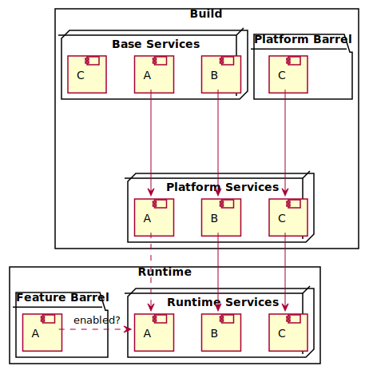

# Application services layer

A service is a module which provides a functionality which may require a platform or environment specific implementation.
All services are initialized before the application is mounted to the DOM.

## Context

In adding iOS Webview to the target environments, abstraction has helped to normalize services interfaces. With the first iteration, both implementations were shipped with the application. Not only caused this larger application bundles, readability of the code and ports for maintenance degraded through a higher cognitive complexity.  
In order to reduce both dimensions of complexity, a more offensive approach to code-splitting and a refactoring of the feature configuration were made.  
As the original ADR was lost in a premature branch purge, this document is supposed to reconstruct its concerns.

## Target platforms

Lesson-player is published for two platforms: `web` and `webview`. The application is built separately for each platform. A service can require a specific implementation per platform.

| Platform  |                                                                                                                        |
| --------- | ---------------------------------------------------------------------------------------------------------------------- |
| `web`     | hosted by the [home app](https://github.com/lessonnine/home.babbel) for desktop/mobile web browsers that support HTML5 |
| `webview` | embedded in core.ios via [WKWebView](https://developer.apple.com/documentation/webkit/wkwebview)                       |

### Platform services index resolving

For each target platform, a dedicated index module is located in `./src/services`. The naming convention for the module file is to use a suffix, which indicates the platform: `index.${platform}.js` -> (for webview) `index.webview.js`.  
Depending on which target platform is set to build, the dedicated index module is resolved by webpack to make sure only necessary code is deployed.

## Feature flags

The application can be configured at runtime, using query parameters. A service can require a specific implementation per feature.
Not all feature flags are supported on each platform. Therefore the configuration of conditional overrides is applied to the target platform index modules before export.

### Barrels

Due to the requirement of ultimately resolving the service configuration at runtime, we use object composition at build and at runtime.

## Webpack Configuration

To support the use of feature toggles at runtime, service configurations are resolved with [conditional overrides](../src/services/overrides/factory.js) on startup.

Example override:

```js
class Service {
  constructor(serviceName) {
    this.serviceName = serviceName;
  }
}

// default services
const commonServices = {
  serviceA: new Service("ServiceA"),
  serviceB: new Service("ServiceB"),
};

// feature specific services
const catServices = {
  serviceB: new Service("CatServiceB"),
};

const catServicesOverride = createServicesOverride(
  catServices,
  "is_cat_preview"
);
// equivalent to
const catServicesOverride = {
  name: "is_cat_preview",
  guard: () => features.get("is_cat_preview"),
  services: catServices,
};

const catApplicationServices = applyOverrides(
  commonServices,
  catServicesOverride
);

// for any url
catApplicationServices.serviceB.name; // ServiceB

// for url `...?is_cat_preview=on...`
catApplicationServices.serviceB.name; // CatServiceB
```

Important: Feature specific overrides are applied sequentially. Since it is possible to override the same service for different features with different implementations, it should be extended with caution.

There are multiple categories of service overrides: `default`, `cat`, `mock` and `native`.
For each category, services are grouped in barrel modules under [`./src/services/barrels`](../src/services/barrels/readme.md).

| Category  |                                                                                                                                                                                                            |
| --------- | ---------------------------------------------------------------------------------------------------------------------------------------------------------------------------------------------------------- |
| `default` | _default_ service implementation, that relies on standard html5 api provided by web browsers                                                                                                               |
| `cat`     | service implementation for running on `cat` stage                                                                                                                                                          |
| `native`  | service implementation, that provides the service´s functionality by either communicating with the [`native` application](https://github.com/lessonnine/core.ios) or wrapping proprietary APIs (e.g. Siri) |
| `mocked`  | service implementation, that provides a mocked interface of the service´s functionality.                                                                                                                   |

---

The configuration of the application service layer follows a complex heuristic that regards feature flags resolved from the URL query parameters, but also depends on environment variables that are set at build time.



## Usage

```js
import services from "./services";

const { soundService } = services;

// do something with soundService
```

| Platform  |                                |
| --------- | ------------------------------ |
| `web`     | in web browsers desktop/mobile |
| `webview` | in core.ios via webview        |
