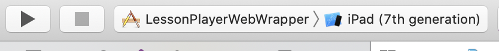
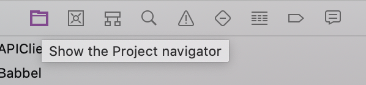
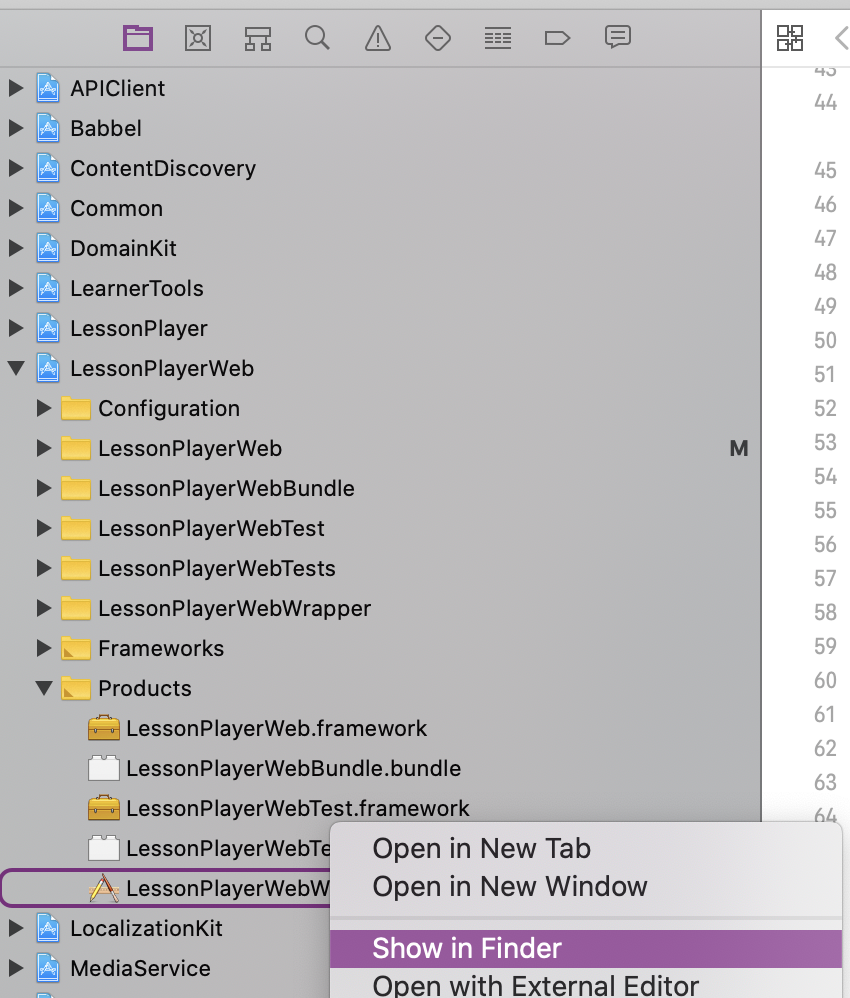

# Mobile tests with appium

The lesson-player.spa is shown in a webview on mobile devices. This requires
writing and running tests with appium instead of selenium.

* [Running the tests on a simulator](#running-the-tests-on-a-simulatore)
  * [Installation](#installation)
  * [Troubleshooting](#troubleshooting)
  * [Praparing the app under test](#praparing-the-app-under-test)
  * [Finding a suitable iOS simulator](#finding-a-suitable-ios-simulator)
  * [Appium](#appium)
  * [Running the tests](#running-the-tests)
* [Writing new tests](#writing-new-tests)

## Running the tests on a simulator

This section should enable you to run the UATs on a simulator (for now, only iPad)
on your computer.

### Installation
- Install [appium](https://github.com/appium/appium-desktop/releases) console version
- Install Xcode (you can use the app store to install the current version and [this page](https://developer.apple.com/download/more) for past versions). Installing Xcode installs the simulators.
- Install [`carthage`](https://github.com/Carthage/Carthage) (required by Appium)

### Troubleshooting

In case the tests are not working, Appium provides a troubleshooting tool called [`appium-doctor`](https://github.com/appium/appium-doctor). Verify your setup by running `appium-doctor --ios`. Diagnostics for _required_ dependencies should all be green.

### Praparing the app under test
- Build the Babbel LessonPlayerWebWrapper app in Xcode.
  - Select build target and device 
  - Hit command+b on your keyboard or click on Product > Build in Xcode to build the LessonPlayerWebWrapper
  - Find the bundle in your finder
    
    
  - Alternatively: The location should be something like `~/Library/Developer/Xcode/DerivedData/Babbel-fdehdexrnrvgvgbautgidxyybjjj/Build/Products/Debug-iphonesimulator/LessonPlayerWebWrapper.app`
- Copy the absolute path to the `LessonPlayerWebWrapper.app`

### Finding a suitable iOS simulator

In order to start the UATs, a suitable iOS simulator must be found. As mentioned before, the lesson-player only supports iPads at this time. An iPad simulator and runtime version (iOS version) have to be passed to Appium. Xcode provides a tool to find all available simulators grouped by iOS version.

    $> xcrun simctl list devices available iPad
    == Devices ==
    -- iOS 13.7 --
        iPad (7th generation) (65ACDAFD-9578-42EB-B96E-47CCD5F594E4) (Booted)
        iPad Pro (11-inch) (2nd generation) (13ABA517-B810-46CA-9D63-2B12239A4656) (Shutdown)

The output is formatted as `[deviceName] ([UUID]) ([Booted|Shutdown])` and grouped by iOS version. As an example, we choose to run the tests on the 'iPad (7th generation)', and the platformVersion is '13.7'. This information will be passed to appium on startup.

### Appium
- Run appium

```bash
$ appium --default-capabilities '{"deviceName":"iPad (7th generation)","platformVersion":"13.7", "app": "/path/to/the/LessonPlayerWebWrapper.app"}'
```

**Note** The `app` key should point to the previously copied path to the built `LessonPlayerWebWrapper.app`.

After starting up, appium should print out that it runs on localhost and port 4723, these are the standard values

```bash
[Appium] Appium REST http interface listener started on 0.0.0.0:4723
```

You can change them using the flags `-a` and `-p`

```bash
appium -a 127.0.0.1 -p 4444
```

### Running the tests

When running the tests, make sure to exclude the tag @correct\_errors because the 'correct errors' feature does not exist on iOS.

Note: not all tests can pass yet. The following folders should work, though:

```bash
DRIVER=ipad bundle exec cucumber features/localization/ -t 'not @correct_errors'
DRIVER=ipad bundle exec cucumber features/paywall/ -t 'not @correct_errors'
DRIVER=ipad bundle exec cucumber features/progress-bar/ -t 'not @correct_errors'
```

We need to set `DRIVER=ipad` so that the test suite knows to run the session via appium. Some capabilities are passed to appium via the config file `config/config.yml` section `ipad`.

## Writing new tests

It is worth mentioning that there is a [GUI version of appium](https://github.com/appium/appium-desktop#appium-desktop). It has an Inspector that enables you to inspect running test sessions or start new sessions with capabilities to your liking. With the inspector, you can easily find out selectors to use in tests or investigate why tests are failing. To use the inspector, start a test as described before, start the GUI version of appium and open the [new session window](https://github.com/appium/appium-desktop#the-new-session-window). There you find the possibility 'Attach to Session..'. It might take a while until the session shows up, hit the refresh button a couple of times..

It is also possible to inspect running sessions using the [Accessibility Inspector](https://developer.apple.com/library/archive/documentation/Accessibility/Conceptual/AccessibilityMacOSX/OSXAXTestingApps.html) provided by Xcode. You can start it via Spotlight or Xcode.
